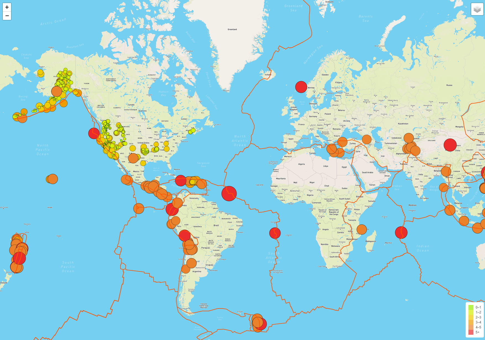
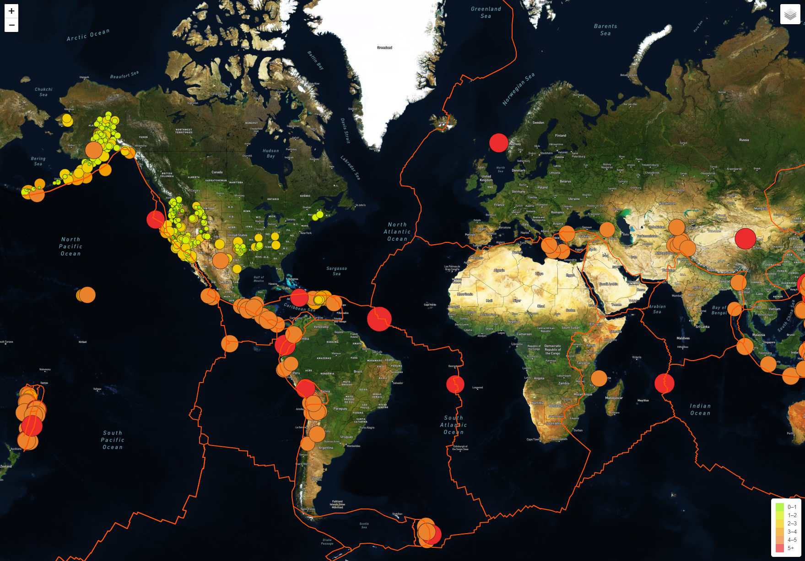
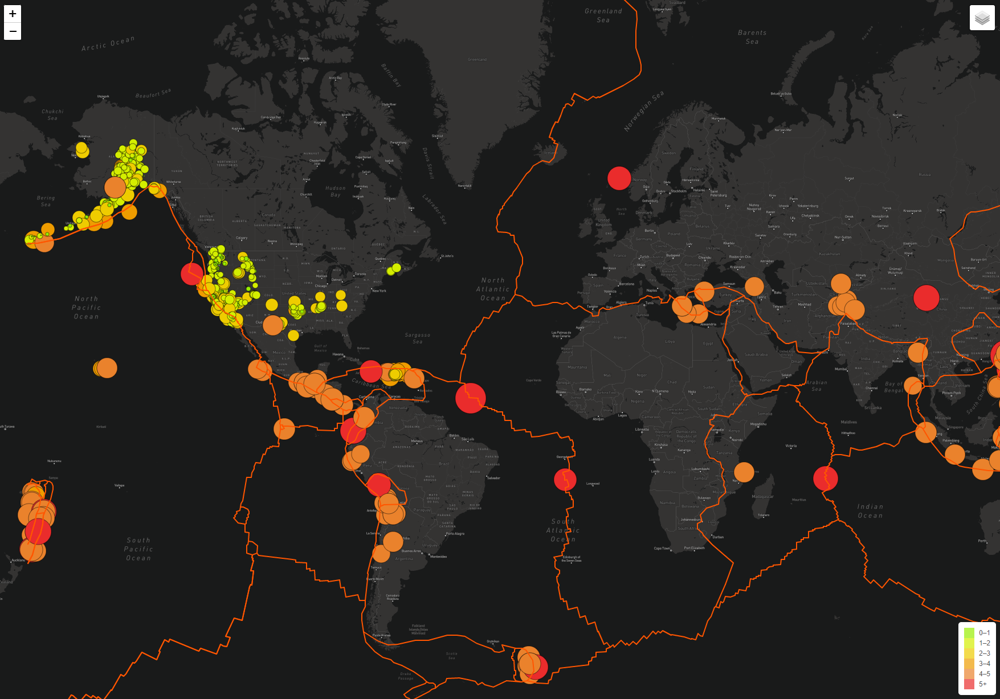
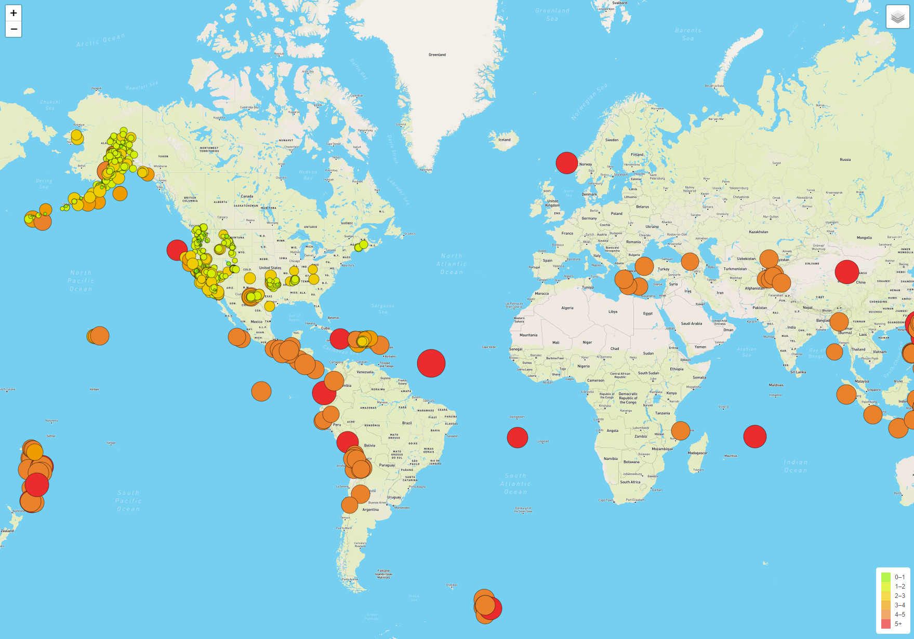
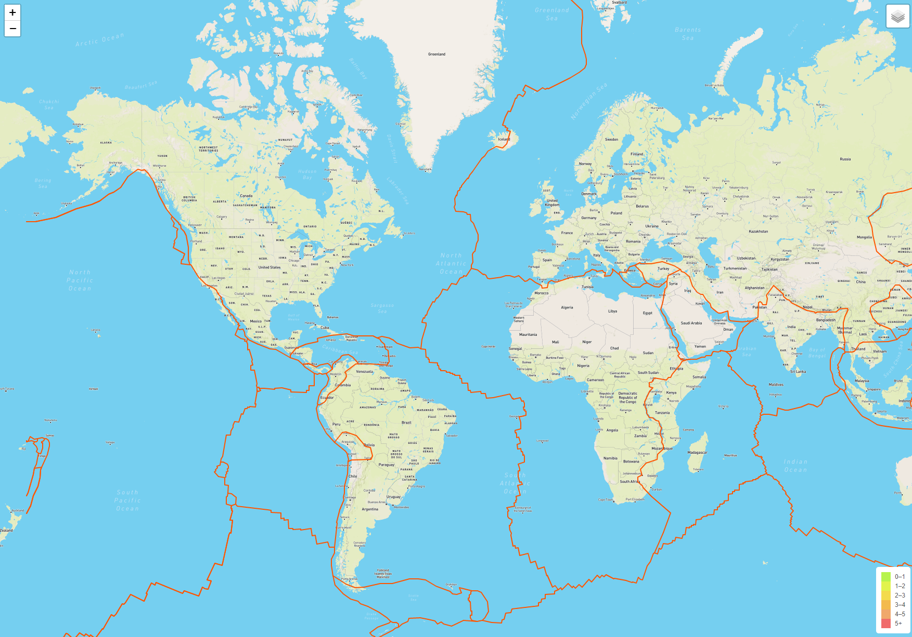
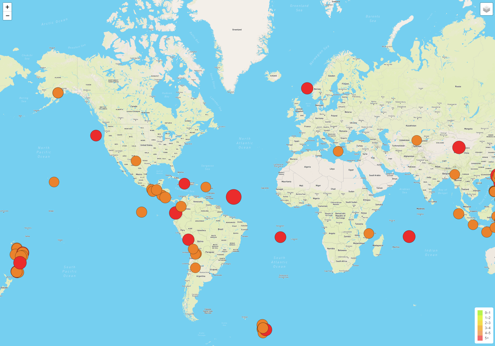

# Mapping_Earthquakes

## Overview
The purpose of this challenge was to create an interactive map that captures earthquake data from around the world by displaying them as circle markers on a map. In addition to the markers, 3 different types of maps and 3 different layers of information were also needed. Alas, a map is not complete without a legend. In this challenge, the legend was created with a color scale in correlation with the size of the earthquake magnitude.  

## Results
Here we are able to see the three different types of map that shows all the components of the earthquake data.

| Street Map | Satellite Map | Dark Map |
| :---: | :---: | :---: |
|  |  |  |

The following images shows how interactive the map can be by turning on and off the different layers. We can clearly see what we want with our desire selection.

| All Earthquakes | Tectonic Plates | Major Earthquakes Only |
| :---: | :---: | :---: |
|  |  |  |

## Summary
Overall, once the concept of adding layers and different maps are understood then there are infinite ways to make the maps more unique and interactive. This challenge shows just how impactful data can be with the use of interactive maps. 
